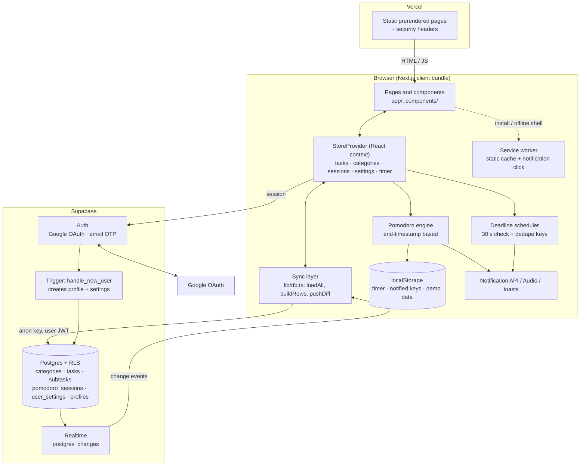
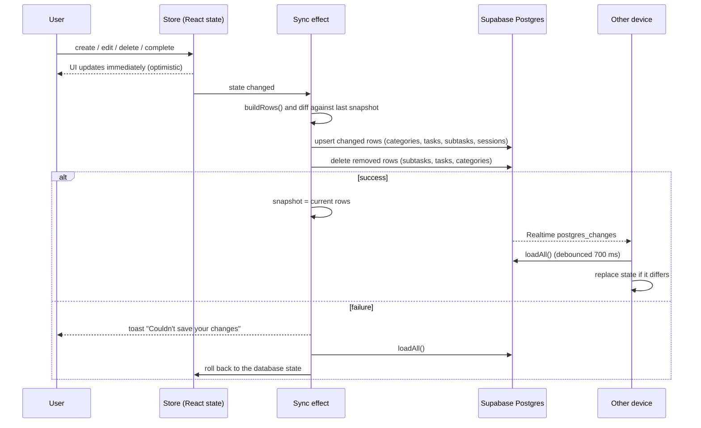
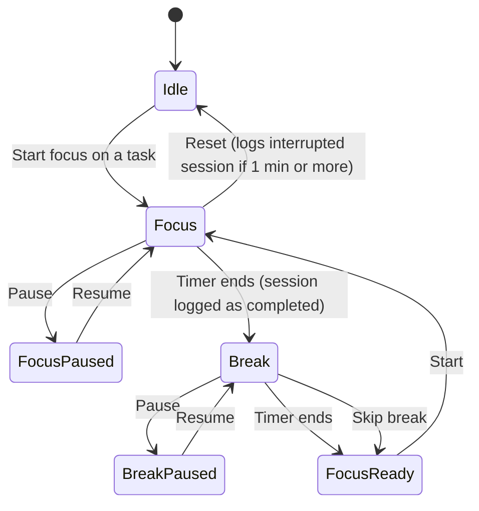
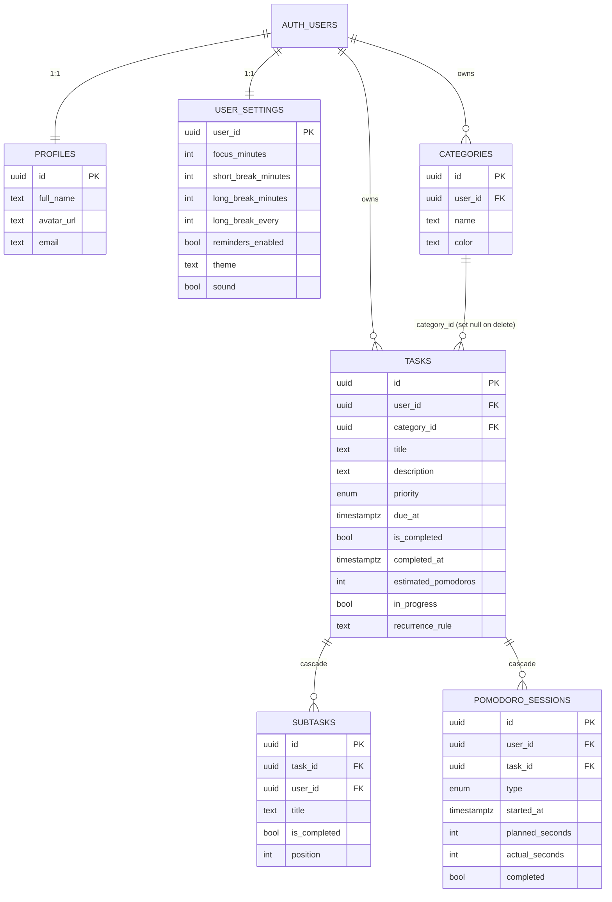

# Wave

**Ride every deadline, don't chase it.**

Wave is a student task manager that connects *planning* work to *doing* it. Tasks carry priorities, categories and deadlines; each task has its own Pomodoro timer; reminders nudge you before things are due; and a small dashboard shows your momentum. It is a black-and-dusty-white, pixel-accented take on a Discord-style app shell, set in Old Standard TT.


---

## Contents

1. [Features](#features)
2. [Tech stack](#tech-stack)
3. [Architecture](#architecture)
4. [Data model](#data-model)
5. [How it works](#how-it-works)
6. [Project structure](#project-structure)
7. [Getting started](#getting-started)
8. [Supabase setup](#supabase-setup)
9. [Deploying to Vercel](#deploying-to-vercel)
10. [Scripts](#scripts)
11. [Security model](#security-model)
12. [Design system](#design-system)
13. [How I built it](#how-i-built-it)
14. [Production audit](#production-audit)
15. [Known limitations](#known-limitations)

---

## Features

| Area | What you get |
|---|---|
| **Tasks** | Create, edit, delete (with a 6-second undo), complete and reopen. Title (≤120 chars), notes (≤2000), category, priority, deadline, estimated pomodoros, subtasks with progress, daily/weekly recurrence (completing one spawns the next). |
| **Views** | Pending / Completed / All; Kanban board (To do · In progress · Done) with drag-and-drop plus move buttons for touch; month calendar; Focus page; Categories page; Analytics. |
| **Find things** | Debounced search over title and notes; filter by priority, category and due date (today / this week / overdue); sort by due date, priority, newest, title. **All filter state lives in the URL**, so views are shareable and refresh-safe. |
| **Pomodoro** | One timer per task. 25/5/15 defaults, long break every N sessions (all configurable). Timestamp-based so it stays correct in background tabs; survives refresh; only one timer at a time; sessions logged with per-task stats; sound and notification at the end; tab-title countdown. |
| **Reminders** | Notification API with configurable lead times (15 min / 1 h / 1 day). Permission is requested only from a user click, never on load. If notifications are denied or unsupported, an in-app toast is used instead. Duplicate reminders are prevented. |
| **Insights** | Pending / due today / overdue / done-this-week, completions and focus-minutes charts (7 or 30 days), focus by category, streak, and a small XP/level system (task +10, focus session +5). |
| **Account** | Google OAuth and email magic-link sign-in via Supabase Auth. Export tasks to CSV. Delete all your data. |
| **Platform** | Realtime cross-device sync, installable PWA (manifest + service worker), dark/light/system theme, `N` shortcut for a new task, responsive from 360px up. |
| **Demo mode** | With no Supabase env vars set, Wave runs entirely in the browser (`localStorage`, seeded sample data). |

---

## Tech stack

| Layer | Choice | Notes |
|---|---|---|
| Framework | **Next.js 14.2** (App Router) | Pages are statically prerendered; all data access is client-side. |
| UI | **React 18**, **TypeScript 5** (strict) | |
| Styling | **Tailwind CSS 3.4** + CSS-variable design tokens | Light/dark palettes swap by redefining variables in `app/globals.css`. |
| Font | **Old Standard TT** via `next/font/google` | Self-hosted at build time; no runtime request to Google. |
| Icons | **lucide-react** | Plus hand-drawn pixel-art SVG motifs. |
| Backend | **Supabase**: Postgres, Auth (Google OAuth + email OTP), Realtime | Accessed with `@supabase/supabase-js` using only the anon key. |
| Security | Postgres **Row Level Security** on every table | See [Security model](#security-model). |
| Charts | Small hand-written SVG components | No chart library. |
| Drag and drop | Native HTML5 drag events | No DnD library. |
| Quality | **ESLint** (`next/core-web-vitals`), `tsc --noEmit` | |
| Hosting | **Vercel** (app) + **Supabase** (backend) | |

The PRD proposed TanStack Query, shadcn/ui, Recharts, dnd-kit, React Hook Form and Zod. I deliberately did not use them: app state is a single React context with a diff-based sync layer, the charts and Kanban are small, and validation is done inline and enforced again by Postgres constraints. That keeps the client bundle small (about 87 kB shared first-load JS) at the cost of more hand-written code.

Runtime dependencies are only `next`, `react`, `react-dom`, `@supabase/supabase-js` and `lucide-react`.

---

## Architecture



**Key decisions**

- **Client-side data, RLS-side security.** The browser talks to Postgres directly with the user's JWT. There are no API routes or server actions, so there is no application server to compromise and no second copy of the rules to keep in sync. Every table has RLS, and the anon key is the only key the app ever uses.
- **Optimistic UI with rollback.** State updates instantly; a diff-based sync layer persists it. If a write fails, the app re-reads from the database and shows an error toast.
- **Route protection is client-side.** Pages are static shells; `Shell` renders nothing but a spinner until a session resolves, then redirects to `/login` if there isn't one. No user data is ever in the HTML, and RLS returns nothing without a valid JWT.

### Sync flow



Writes are serialised through a promise chain so they never overlap, and the sync only ever sends rows that changed.

### Pomodoro state machine



While running, the end time (`endsAt = Date.now() + remainingMs`) is stored, and every tick computes `remaining = endsAt − now`. Throttled background tabs therefore cannot drift, and a refresh resumes from `localStorage`. The break after a focus session is short, or long after every N-th session.

---

## Data model



Constraints worth knowing: title is 1–120 characters, description at most 2000, `priority` is `low | medium | high`, `recurrence_rule` is `FREQ=DAILY` or `FREQ=WEEKLY`, and deleting a category sets its tasks' `category_id` to null rather than deleting them.

The full schema, indexes, triggers and RLS policies are in [`supabase/setup.sql`](supabase/setup.sql). A `push_subscriptions` table exists for a future Web Push feature but the app does not use it yet. All timestamps are `timestamptz` (UTC) and are rendered in the user's local timezone.

---

## How it works

**Auth.** `signInWithOAuth({ provider: 'google' })` or `signInWithOtp({ email })` redirects back to `${origin}/app`; supabase-js exchanges the code and persists the session. A DB trigger (`handle_new_user`) creates the `profiles` and `user_settings` rows on first sign-in. Sign-out clears local state and the running timer.

**Store (`lib/store.tsx`).** One provider owns all state and exposes actions. On load it either hydrates from `localStorage` (demo mode) or loads the signed-in user's rows from Supabase. It also runs the timer, the reminder scheduler, theme application and the realtime subscription.

**Sync (`lib/db.ts`).** `buildRows()` converts app state to DB rows; `pushDiff()` compares them with a per-row JSON snapshot and sends only inserts, updates and deletes, in foreign-key-safe order. Sessions belonging to deleted tasks are excluded, so *Undo* re-inserts them.

**Reminders.** Every 30 s (and on load) each pending task with a deadline is checked against the user's lead times. A key `taskId:dueAt:leadMinutes` is stored in `localStorage` so a reminder fires once, and editing a due date produces a new key. Permission is requested only from an explicit click.

**Recurring tasks.** Completing a recurring task clones it (with fresh, unchecked subtasks) and moves the due date forward by a day or a week, skipping dates already past.

**PWA.** `public/manifest.webmanifest` and `public/sw.js` make Wave installable. The service worker caches only hashed `/_next/static/` assets; data always comes from the network. It registers in production builds only.

---

## Project structure

```
app/
  layout.tsx            Root layout: font, metadata, StoreProvider, SW registration
  page.tsx              Public landing page
  login/                Sign-in (Google + email link; demo form if Supabase is unset)
  app/                  Authenticated area (wrapped by <Shell>, noindex)
    page.tsx            Home dashboard
    tasks/  board/  calendar/  focus/  categories/  analytics/  settings/
  error.tsx  not-found.tsx  globals.css
components/
  Shell.tsx             Sidebar, mobile nav, header, toasts, route guard
  ContextPanel.tsx      Right-hand panel (timer, deadlines, level), 1280px and up
  TaskCard.tsx  TaskForm.tsx  FocusDialog.tsx  Charts.tsx
  Pixel.tsx  Logo.tsx   Pixel-art wave, droplet, segmented bar, logo
  useFocusTrap.ts  SwRegister.tsx
lib/
  store.tsx             State, timer, reminders, auth, sync orchestration
  db.ts                 Supabase client, row types, load/diff/push
  types.ts  utils.ts    Types, date helpers, streak/XP, CSV, seed data
supabase/
  migrations/0001-0004  Schema, settings column, board + realtime, RLS hardening
  setup.sql             All migrations combined, for a fresh project
public/                 manifest, service worker, icon
```

---

## Getting started

Requires Node 18.17 or newer (developed on Node 24).

```bash
npm install
cp .env.example .env.local   # optional: leave the Supabase values empty for demo mode
npm run dev                  # http://localhost:3000
```

**Environment variables** (see `.env.example`):

| Variable | Browser-safe | Purpose |
|---|---|---|
| `NEXT_PUBLIC_SUPABASE_URL` | yes | Supabase project URL |
| `NEXT_PUBLIC_SUPABASE_ANON_KEY` | yes | Public anon key (RLS protects the data) |
| `NEXT_PUBLIC_SITE_URL` | yes | Canonical origin for metadata |
| `SUPABASE_SERVICE_ROLE_KEY` | **no** | **Not used by the app.** Never expose it; leave it out of Vercel. |
| `NEXT_PUBLIC_VAPID_PUBLIC_KEY`, `VAPID_PRIVATE_KEY` | public / private | Reserved for future Web Push |

`.env*.local` is gitignored. `NEXT_PUBLIC_*` values are inlined at build time, so rebuild after changing them.

---

## Supabase setup

1. Create a project and copy the URL and anon key (Settings → API) into `.env.local`.
2. In the **SQL Editor**, run [`supabase/setup.sql`](supabase/setup.sql) once. If you already ran an earlier version, run only `supabase/migrations/0004_harden_rls.sql`.
3. **Authentication → Providers:** Email is on by default. For Google, enable it and paste your OAuth client ID and secret (they live in the Supabase dashboard only, never in this repo).
4. **Google Cloud Console → OAuth client (Web application):**
   - Authorised redirect URI: `https://<project-ref>.supabase.co/auth/v1/callback`
   - Authorised JavaScript origins: `http://localhost:3000` and your production origin
5. **Authentication → URL Configuration:** set **Site URL**, and add `http://localhost:3000/app` and `https://<your-domain>/app` under **Redirect URLs**.

Without step 2 the login page will tell you the tables don't exist yet.

---

## Deploying to Vercel

1. Import the repo (framework preset Next.js, build command `npm run build`).
2. Add `NEXT_PUBLIC_SUPABASE_URL`, `NEXT_PUBLIC_SUPABASE_ANON_KEY` and `NEXT_PUBLIC_SITE_URL` (your production origin). Do **not** add the service-role key.
3. Complete the Supabase **Site URL / Redirect URLs** and Google OAuth steps above for the production domain.
4. Deploy, then sign in with both providers on the live URL and confirm refresh and logout behave.

No `localhost` URL is required in production: OAuth redirects use `window.location.origin`.

---

## Scripts

| Command | What it does |
|---|---|
| `npm run dev` | Development server |
| `npm run build` | Production build (also lints and type-checks) |
| `npm run start` | Serve the production build |
| `npm run lint` | ESLint (`next/core-web-vitals`) |
| `npm run typecheck` | `tsc --noEmit` |

---

## Security model

- **RLS on every table.** Users can only select, insert, update and delete their own rows.
- **Referenced rows are ownership-checked** (migration `0004`): a task's `category_id`, a subtask's `task_id` and a session's `task_id` must belong to the same user, so one user cannot attach their rows to another's ID.
- **Server-side limits** mirror the UI (title ≤120, description ≤2000, duration ranges).
- **No secrets in the client.** Only the anon key is used; the service-role key is never referenced by code. A scan of the production bundle found no secret values.
- **Input is rendered as text.** No `dangerouslySetInnerHTML`. CSV export neutralises spreadsheet formula injection.
- **Errors are generic.** Raw database and auth messages are not shown to users.
- **Headers:** `X-Content-Type-Options`, `X-Frame-Options: DENY`, `Referrer-Policy`, `Permissions-Policy`.
- **Protected pages** are `noindex` and render no user data until a session is verified.

---

## Design system

- **Palette:** near-black `#0A0A0A` and dusty off-white `#E8E4DC`, with a single neutral accent. Light is the default; dark is under Settings → Appearance. Tokens are CSS variables (`--bg`, `--surface`, `--fg`, `--muted`, `--line`, `--accent`, …) mapped into Tailwind.
- **Type:** Old Standard TT throughout (regular and bold).
- **Layout:** a Discord-inspired shell with a left sidebar, main column and an optional right context panel. Content is open rows and dividers rather than boxes; cards appear only where grouping helps (Kanban, forms, dialogs).
- **Identity:** pixel-art wave logo, slow stepped pixel waves, a pixel droplet bullet and segmented XP bars.
- **Meaning without colour:** priority always has a text label, and high-priority chips are inverted, so nothing relies on hue.
- **Motion** respects `prefers-reduced-motion`.

---

## How I built it

I built Wave with Claude Code (Anthropic's coding agent), working from the PRD and two sample UI designs I supplied (a dark dashboard and a light landing page) as *inspiration only*.

1. **Foundation.** Hand-scaffolded Next.js 14 + TypeScript + Tailwind; defined the domain types, date/streak/CSV helpers and seed data.
2. **Local-first prototype.** Built the whole product against `localStorage` first: tasks, categories, URL-state filters, the timestamp-based Pomodoro engine, the reminder scheduler, dashboard, calendar and settings. This allowed fast testing without a backend.
3. **Supabase.** Turned the PRD's SQL into migrations with RLS, added Google and email auth, and replaced persistence with a diff-based sync layer (rather than rewriting every action), keeping the local-first store and demo mode intact.
4. **Extras.** Kanban board, recurring tasks, realtime sync and PWA install.
5. **Redesign passes.** Discord-style shell and context panel, pixel/wave motifs and XP; then Old Standard TT and a black/dusty-white theme; then a contrast fix that made off-white the default.
6. **Production audit.** A full review for correctness, security and deployment readiness: RLS hardening, rollback on failed writes, focus traps, CSV safety, real ESLint, security headers and metadata (see below).

Each stage was checked by type-checking, linting and building, and by driving the running app in a browser.

---

## Production audit

Verified by running the production build and the app:

- Typecheck, lint and `npm run build` are clean; `npm run start` serves all routes; `/dashboard` and other unknown paths return 404.
- Logged-out access to `/app/tasks` redirects to `/login` and shows no task data. Anonymous inserts into `categories` and `tasks` are rejected by the database.
- Task create/edit/delete/undo/complete/reopen, subtasks, category deletion (tasks kept and uncategorised), combined URL filters, timer start/pause/resume/refresh/completion and session logging, reminder de-duplication, CSV output (commas, quotes, newlines, unicode, formulas) and theme switching all pass in the running app.
- No horizontal overflow at 360px on any app page.

**Not verifiable without real accounts, so please test on your deployment:** the Google and email sign-in round-trip, session refresh and logout, and cross-user RLS isolation with two real users.

---

## Known limitations

- **Next.js 14.2.35** is the last 14.x release, and `npm audit` reports advisories fixed only in Next 15.5+ (which needs React 19). Most concern features Wave doesn't use (image optimizer, server actions, middleware, rewrites). Plan an upgrade after launch.
- **Reminders fire only while a Wave tab is open.** Web Push (tab closed) needs VAPID keys and a scheduled Edge Function, and is not built.
- **Tasks load without pagination**, so accounts with more than about 1000 tasks would be truncated by PostgREST's default limit.
- **Route protection is client-side** (the session lives in the browser), not Next.js middleware.
- **A brief theme flash** can occur for dark-mode users because the theme is applied after hydration.
- **A timer that expires while the page is closed** is logged as a completed session when the page is next opened.
- There is **no automated test suite** yet.
- Not built: attachments, Google Calendar sync, AI task breakdown, email reminders, the PRD's `pg_cron` reminder job.

---

## License

See [`LICENSE`](LICENSE).
